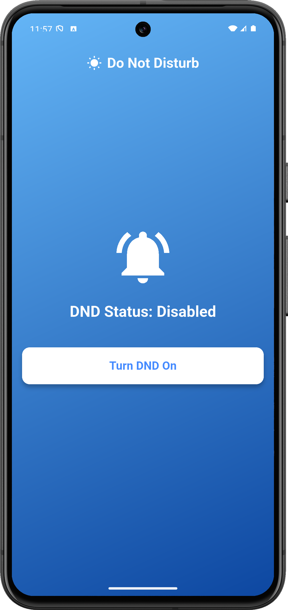
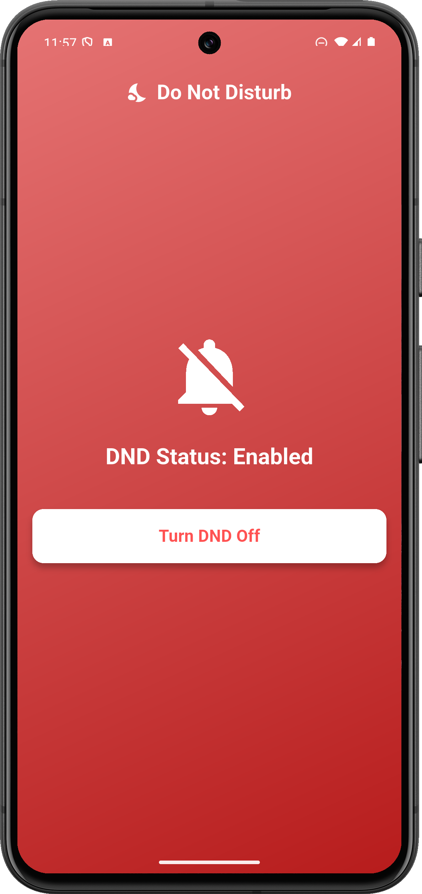

# Simple DND Switch App

A simple and beautifully designed Android application that helps you turn your phone's 'Do Not Disturb' (DND) mode on or off with just a single tap.

## Features

* **One-Tap DND Toggle:** Easily turn DND on or off with a single button.
* **Colorful Visual Feedback:** The app's background color changes automatically to reflect the DND status (red when DND is enabled, and blue when it's disabled).
* **Direct Status Display:** The current DND status is clearly shown on the screen ("Enabled" or "Disabled").
* **Minimalist Design:** A clean and user-friendly interface.

## Screenshots

| DND Disabled State | DND Enabled State |
| :---: | :---: |
|  |  |

## How to Use

1.  Launch the app.
2.  For the first time you enable DND, tap the **"Turn DND On"** button.
3.  The app will prompt you to the phone's settings where you need to grant 'Do Not Disturb' access. Once access is granted, you can return to the app.
4.  After granting access for the first time, you will be able to turn DND mode on or off directly from the app without going to settings again.

## Technologies Used

* **Flutter:** The app is built entirely with the Flutter framework.
* **`do_not_disturb` Plugin:** This app uses the `do_not_disturb` plugin to handle the DND mode functionality.

## Contribution

Feel free to contribute to this project or report any issues by creating a Pull Request or opening an Issue.

## License

This project is licensed under the **[MIT License](https://opensource.org/licenses/MIT)**.